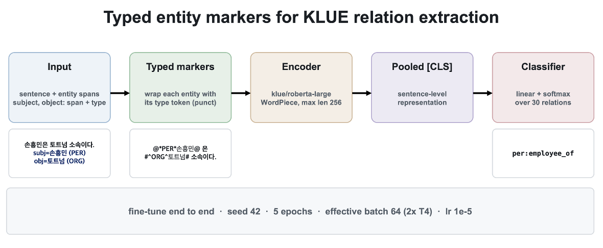
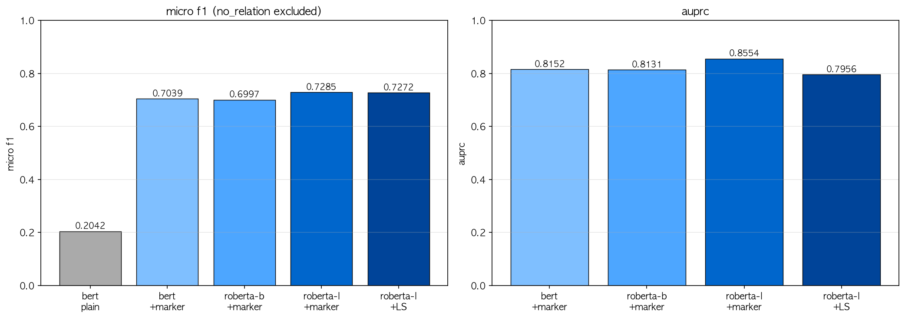

# KLUE Relation Extraction, re-validation

This is an updated version of [SEOL8/KLUE-Relation-Extraction](https://github.com/SEOL8/KLUE-Relation-Extraction).

The original ablation went from a plain-text bert-base (micro F1 0.2042) straight to
roberta-base with typed entity markers (0.6969). That single step changed two things at
once, the backbone and the marker scheme, so the +0.49 jump could not be attributed to
either one. This version adds the missing arm, bert-base **with** markers, so the marker
effect and the backbone effect can be read separately.



Each entity is wrapped in a typed punctuation marker before tokenisation: the subject
becomes `@*TYPE*word@` and the object becomes `#^TYPE^word#`. The marked sentence goes
through `klue/roberta-large`, and the pooled `[CLS]` vector is sent to a linear head over
the 30 KLUE relations.

## What the runs show

Reproduced on a Kaggle T4 run, seed 42.

| model | backbone | markers | lr | micro F1 | AUPRC |
|---|---|---|---|---|---|
| (reference) | bert-base | no | 2e-5 | 0.2042 | 0.3985 |
| M1_marker | bert-base | yes | 2e-5 | 0.7039 | 0.8152 |
| M2 | roberta-base | yes | 2e-5 | 0.6997 | 0.8131 |
| M3 | roberta-large | yes | 1e-5 | 0.7285 | 0.8554 |
| M3_LS | roberta-large | yes + label smoothing | 1e-5 | 0.7272 | 0.7956 |



## Limitations

A few things to keep in mind before reading too much into the secondary numbers.

- Single seed. Every row is one run at seed 42. There are no error bars, and the GPU path
  is not fully deterministic, so differences below roughly 0.01 micro F1 are not meaningful.
- Validation is doing double duty. The same KLUE validation split picks the best epoch
  (early stopping) and reports the final score, since the KLUE test labels are not public.
  The reported numbers are therefore a mild over-estimate of held-out performance.
- The size arm changes two things. M2 to M3 swaps roberta-base for roberta-large and also
  lowers the learning rate, so its +0.029 mixes model size with the learning-rate change.
- Effective batch is 64 on a 2x T4 (per device 16 or 32, times two GPUs, times accumulation).
  On a single GPU the effective batch halves, so a one-GPU rerun will not match these numbers
  exactly. The warmup steps are computed from the single-GPU step count, which puts warmup
  near 20 percent of training rather than the intended 10; this is the same for every model.
- The 0.2042 plain-bert reference is carried over from the earlier project rather than rerun
  in this batch, so the +0.50 marker gain compares across two environments. 

## Two micro-F1 conventions

`micro_f1` in the notebooks drops rows whose true label is `no_relation`, then runs micro
F1 on the rest. The KLUE definition keeps every row and restricts the label set to 1..29,
which also penalises `no_relation` rows predicted as a relation. On M3 the first reads
0.7285 and the second reads about 0.689; the over-detected `no_relation` rows account for
the gap. The model comparison is unaffected since every model uses the same metric, but the
KLUE number is the one to quote against the public 0.65 baseline. `error_analysis.py`
prints both.

## Layout

```
m1_marker.ipynb       bert-base + markers
m2.ipynb              roberta-base + markers
m3.ipynb              roberta-large + markers, saves logits/labels and the best checkpoint
m3_ls.ipynb           roberta-large, then a label-smoothing continuation
compare_models.py     reads results/*/metrics.json, prints the breakdown, draws the bar chart
error_analysis.py     per-class F1 and error composition from the saved M3 predictions
results/pipeline.png  the method figure 
results/              metrics.json and figures from the Kaggle T4 run
```

`results/M3_LS/` holds metrics only. The Kaggle session that produced the reproduced
M3_LS numbers shut down before its figures were saved, so the loss curve and confusion
matrix for that arm are omitted rather than carried over from the older run.

Each notebook is self-contained: it loads `klue/klue` re, builds the markers, trains one
model, and writes `results/<model>/`. They were built for a Kaggle T4 GPU and fix seed 42.

